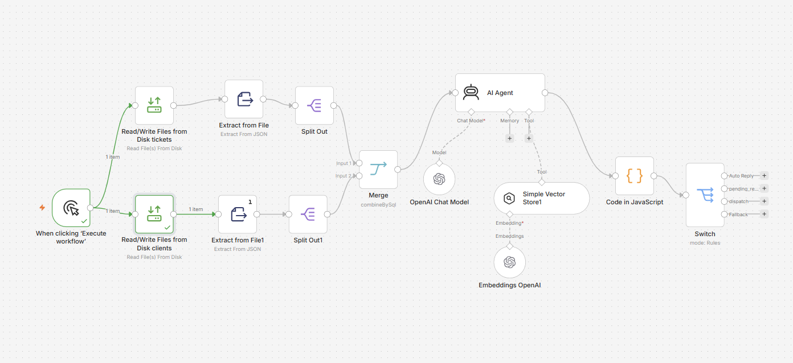

# AI Agent Customer Support for ACME Corporation

## Descrizione

Questo progetto implementa un sistema di gestione automatica dei ticket di supporto sviluppato con **n8n** e basato su un **AI Agent**. Il workflow utilizza un approccio **Retrieval-Augmented Generation (RAG)** per consultare una knowledge base aziendale e classificare automaticamente le richieste.

---

## Features

- AI Agent sviluppato con n8n
- Retrieval-Augmented Generation (RAG)
- OpenAI Chat Model
- OpenAI Embeddings
- Simple Vector Store
- Docker
- JSON Dataset
- Automatic Ticket Routing

---

## Workflow

Di seguito è mostrato il workflow principale implementato in n8n.



### Workflow Overview

Il workflow esegue le seguenti operazioni:

1. Carica i ticket (`tickets.json`).
2. Carica i dati dei clienti (`clients.json`).
3. Unisce le informazioni tramite il nodo Merge.
4. Interroga l'AI Agent.
5. Consulta la knowledge base tramite il Simple Vector Store (RAG).
6. Genera la risposta.
7. Classifica il ticket tramite il nodo Switch:
   - Auto Reply
   - Dispatch
   - Pending Reply

---

## Struttura del progetto

AIAgentProject/
│
├── README.md
│
├── docs/
│   └── ACME_Corporation.md
│
├── workflows/
│   ├── Load_FAQ.json
│   └── Project_Work.json
│
├── data/
│   ├── tickets.json
│   ├── clients.json
│   └── FAQ.md
│
├── report/
│   └── Technical_Report.md
│
└── output/
    ├── auto_reply.json
    ├── pending_reply.json
    └── dispatch.json

---

## Requisiti

- Docker Desktop
- n8n
- OpenAI API Key

---

## Configurazione Docker

Per consentire ai workflow di leggere i file del progetto, la cartella `AIAgentProject` deve essere montata nel container Docker nel percorso `/data`.

Il container Docker deve essere avviato montando la cartella del progetto nel percorso `/data` e configurando la seguente variabile d'ambiente:

N8N_RESTRICT_FILE_ACCESS_TO=/data;/home/node/.n8n-files


I workflow utilizzano i seguenti percorsi:

- `/data/data/tickets.json`
- `/data/data/clients.json`
- `/data/data/FAQ.md`

---

## Installazione

1. Avvia Docker Desktop.
2. Avvia il container n8n.
3. Importa i workflow:
   - workflows/Load_FAQ.json
   - workflows/Project_Work.json
4. Configura le credenziali OpenAI.
5. Verifica che i nodi Read/Write Files utilizzino i seguenti percorsi:

   - /data/data/tickets.json
   - /data/data/clients.json
   - /data/data/FAQ.md

---

## Esecuzione

### 1. Caricamento della Knowledge Base

Eseguire il workflow **Load FAQ** per:

- leggere `FAQ.md`;
- generare gli embedding;
- caricare il contenuto nel Simple Vector Store.

### 2. Elaborazione dei ticket

Eseguire il workflow **Project Work**.

Il workflow:

- legge i ticket;
- recupera i dati del cliente;
- consulta la knowledge base;
- genera un output JSON;
- instrada il ticket tramite il nodo Switch.

---

## Dataset

- `tickets.json`
- `clients.json`
- `FAQ.md`

---

## Output

Il workflow produce una delle seguenti azioni:

- `auto_reply`
- `pending_reply`
- `dispatch`

---

## Report

La documentazione tecnica è disponibile nel file:

```
report/Technical_Report.md
```